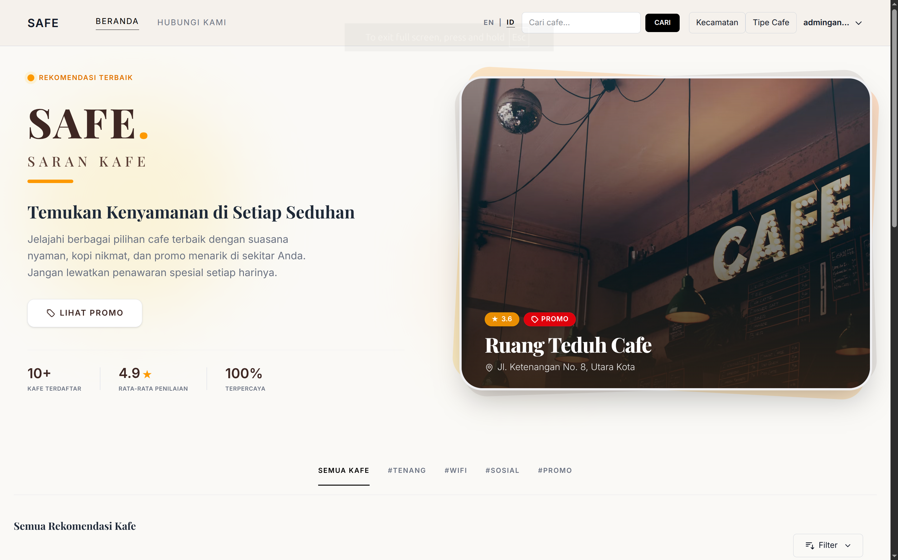
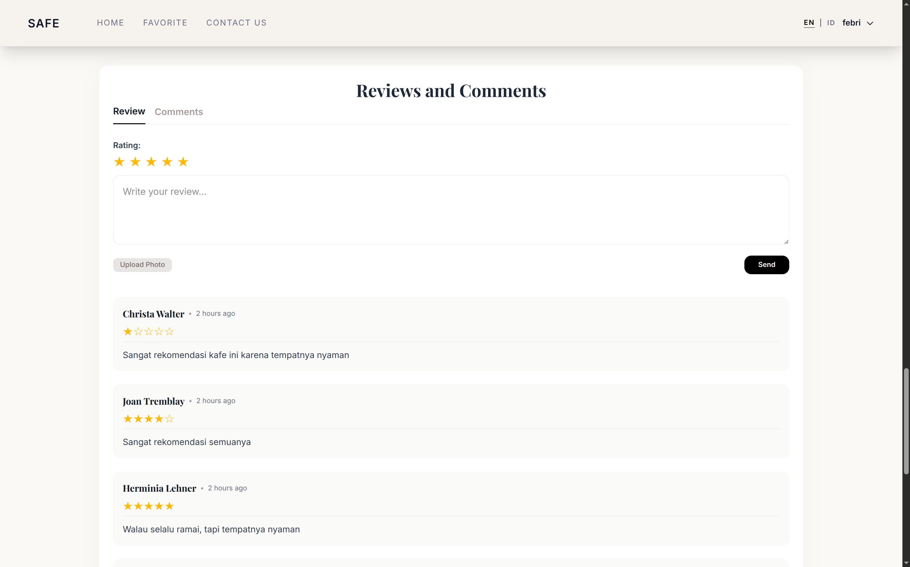
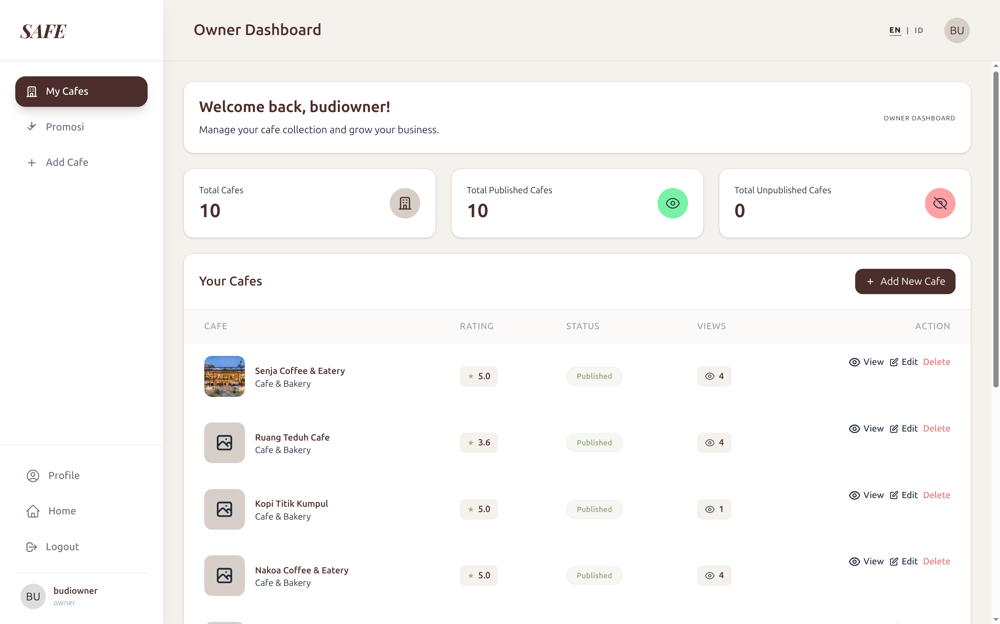
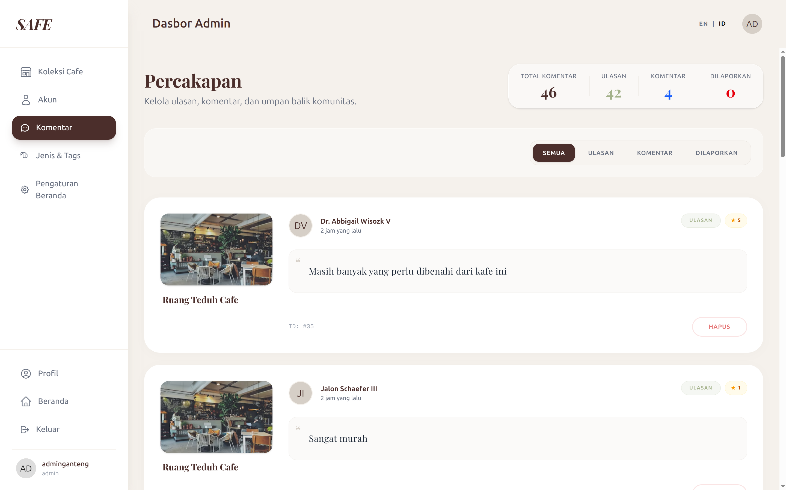
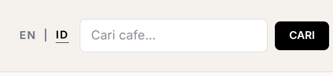

<div align="center">

<!-- Space untuk Video Promosi -->
[](https://www.youtube.com/watch?v=CwDxRBHpLtA)

# Sistem Rekomendasi Kafe

Sebuah aplikasi web inovatif yang dirancang untuk membantu pengguna menemukan kafe terbaik sesuai dengan preferensi mereka. Dilengkapi dengan fitur ulasan, rating, dan panel manajemen kafe yang komprehensif.

[](https://laravel.com)
[](https://tailwindcss.com/)
[](https://laravel-livewire.com/)

</div>

---

## 📋 Daftar Isi
- [Fitur Utama](#-fitur-utama)
- [Persyaratan Sistem](#-persyaratan-sistem)
- [Panduan Instalasi](#-panduan-instalasi)
- [Penggunaan](#-penggunaan)
- [Kontributor](#-kontributor)

---

## ✨ Fitur Utama

- **Pencarian & Filter Pintar**: Cari kafe berdasarkan nama, tipe, atau lokasi.
  <br><br>
- **Sistem Ulasan & Rating**: Pengguna dapat memberikan ulasan (dengan dukungan gambar) dan rating (1-5 bintang).
  <br><br>
- **Manajemen Kafe (Owner Dashboard)**: Pemilik kafe dapat mengelola profil kafe, jam operasional, menu, dan melihat statistik kunjungan/ulasan secara *real-time*.
  <br><br>
- **Moderasi Komentar (Admin)**: Sistem pelaporan komentar (Report System) untuk memoderasi ulasan yang tidak pantas.
  <br><br>
- **Dukungan Dua Bahasa (Bilingual)**: Tersedia opsi Bahasa Indonesia dan English untuk antarmuka pengguna.
  <br><br>

## 💻 Persyaratan Sistem

Sebelum menjalankan aplikasi ini, pastikan sistem Anda telah memenuhi persyaratan berikut:
- PHP >= 8.1
- Composer
- Node.js & NPM
- Database MySQL atau PostgreSQL

## 🚀 Panduan Instalasi

Ikuti langkah-langkah di bawah ini untuk menjalankan project ini secara lokal:

1. **Clone Repository**
   ```bash
   git clone https://github.com/username/PBL-Rekomendasi_Cafe.git
   cd PBL-Rekomendasi_Cafe
   ```

2. **Install Dependencies**
   Install dependensi PHP dan Node.js:
   ```bash
   composer install
   npm install
   ```

3. **Konfigurasi Environment**
   Salin file `.env.example` menjadi `.env` lalu sesuaikan konfigurasi database Anda:
   ```bash
   cp .env.example .env
   ```
   Generate application key:
   ```bash
   php artisan key:generate
   ```

4. **Migrasi & Seeding Database**
   Jalankan migrasi untuk membuat tabel beserta data awal (dummy data):
   ```bash
   php artisan migrate --seed
   ```

5. **Build Aset Frontend**
   Kompilasi aset CSS dan JavaScript:
   ```bash
   npm run build
   # atau jika dalam tahap development
   npm run dev
   ```

6. **Jalankan Local Server**
   ```bash
   php artisan serve
   ```
   Aplikasi Anda kini bisa diakses melalui `http://localhost:8000`.

## 🛠️ Penggunaan

- **Akses Pengunjung**: Akses halaman utama untuk melihat daftar kafe dan melakukan pencarian.
- **Dashboard Pemilik Kafe**: Login dengan akun bertipe *Owner* untuk mengelola detail kafe yang terdaftar atas nama Anda.
- **Panel Admin**: Login dengan akun bertipe *Admin* untuk mengelola pengguna, memoderasi ulasan, dan mengonfigurasi master data aplikasi.

## 👥 Kontributor

Project ini dikembangkan sebagai bagian dari Tugas Pembelajaran Berbasis Proyek (Project-Based Learning). 
- **[Nama Anda/Tim]** - Pengembang Utama

---
<p align="center">Dibuat dengan ❤️ untuk para pecinta kopi.</p>